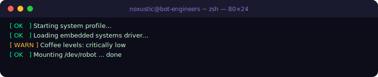
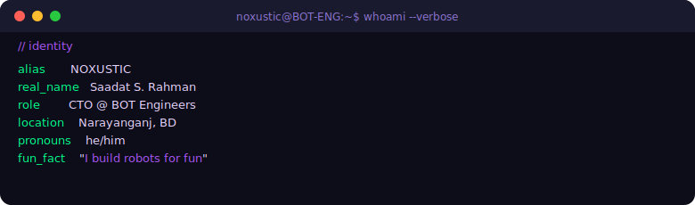
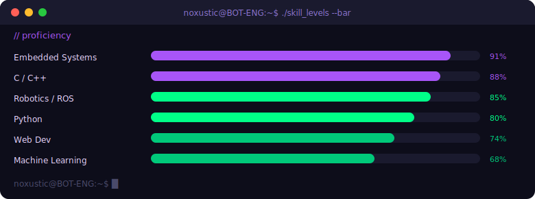
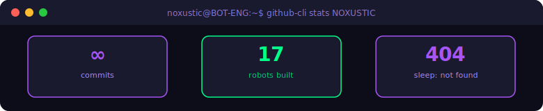
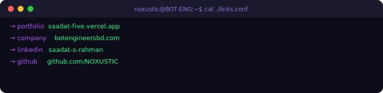
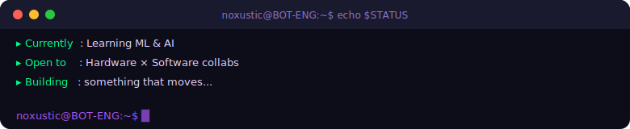

<p align="center">
  
</p>

<p align="center">
  
</p>

---

<p align="center">
  
</p>

---

```zsh
noxustic@BOT-ENG:~$ lspci | grep -i "skill"
```

**`// embedded + robotics`**

<p align="left">
  
  
  
  
  
  
  
  
  
</p>

**`// languages`**

<p align="left">
  
  
  
  
  
  
</p>

**`// web + backend`**

<p align="left">
  
  
  
  
  
</p>

**`// design + viz`**

<p align="left">
  
  
  
  
</p>

---

<p align="center">
  
</p>

---

<p align="center">
  
</p>

<p align="center">
  
  
</p>

<p align="center">
  
</p>

---

<p align="center">
  
</p>

<p align="center">
  <a href="https://saadat-five.vercel.app"></a>
  <a href="https://www.botengineersbd.com"></a>
  <a href="https://bd.linkedin.com/in/saadat-s-rahman-7634a1277"></a>
  <a href="https://github.com/NOXUSTIC"></a>
</p>

---

<p align="center">
  
</p>

<p align="center">
  
  
  
</p>
